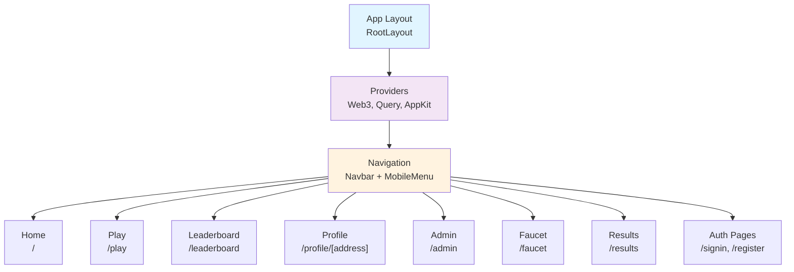
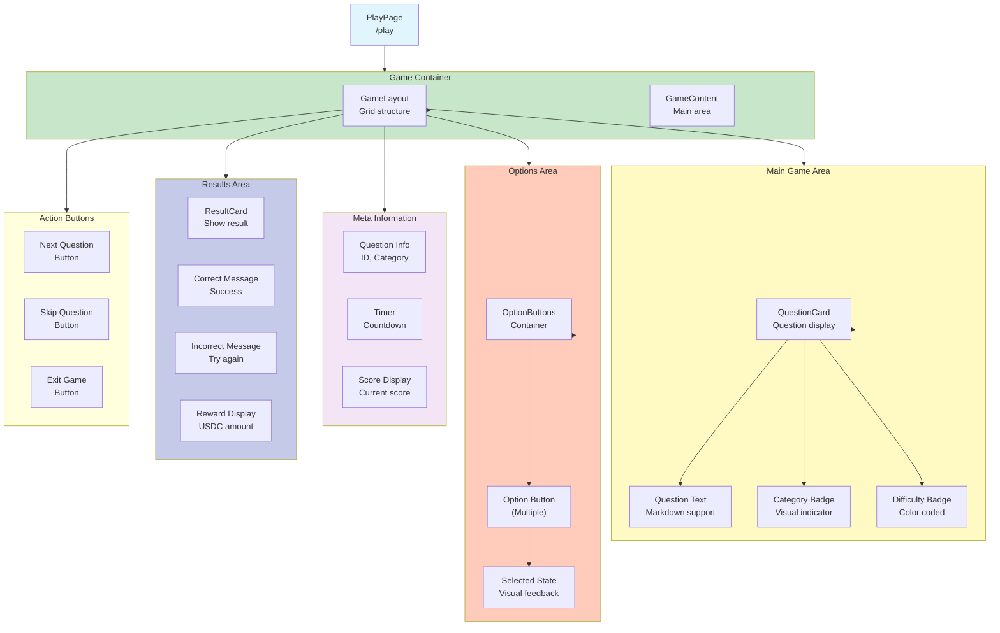
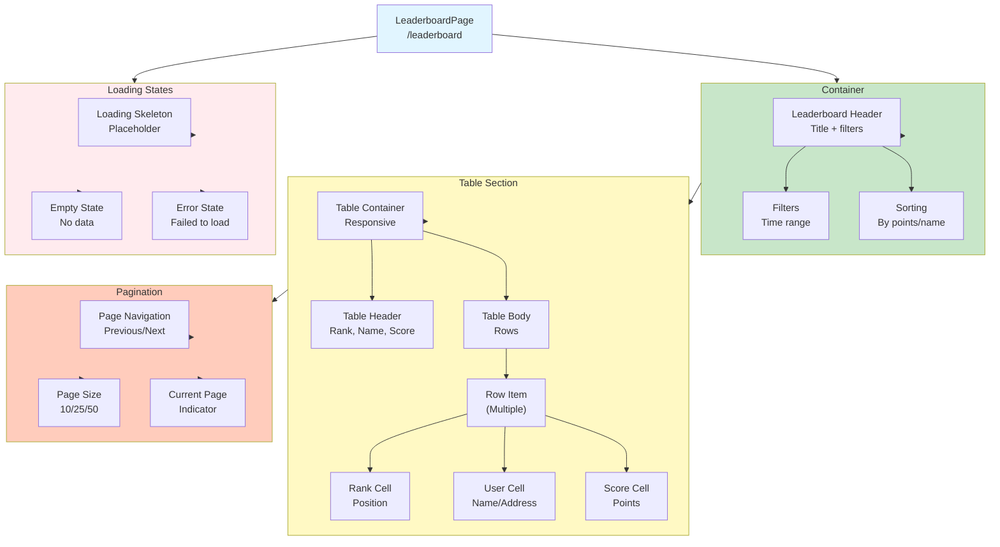
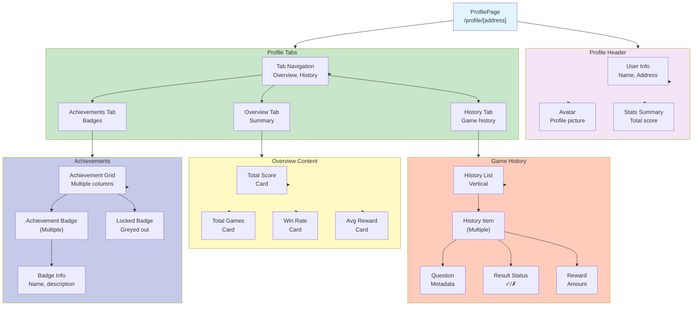
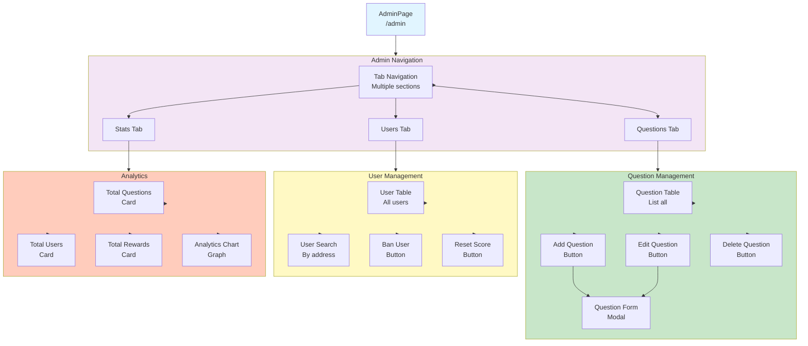
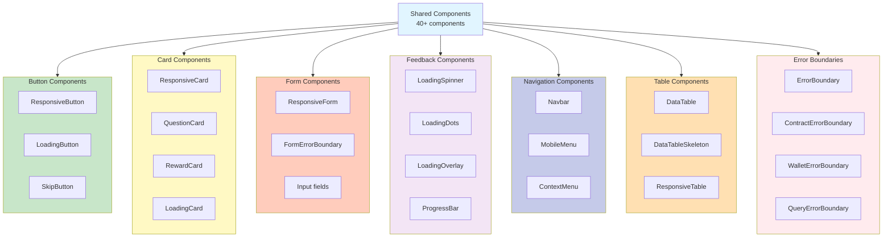
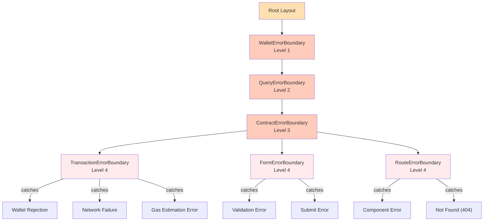
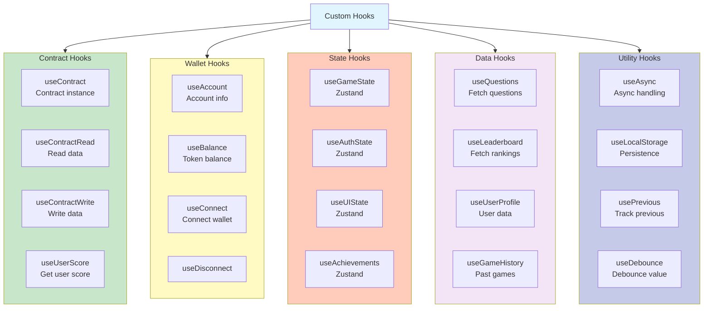
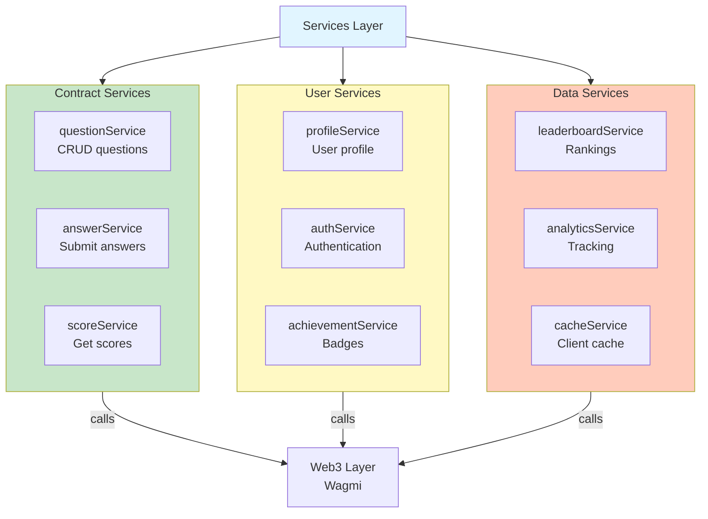

# Frontend Component Hierarchy & Relationships

This document provides detailed component diagrams and relationships for the Zali frontend.

---

## 1. Route Structure



---

## 2. Play Page Component Tree



---

## 3. Leaderboard Component Structure



---

## 4. Profile Page Components



---

## 5. Admin Dashboard Components



---

## 6. Shared Component Categories



---

## 7. Error Boundary Hierarchy



---

## 8. Custom Hooks Organization



---

## 9. Service Layer Architecture



---

## 10. Data Flow Through Components

```mermaid
graph LR
    User["👤 User"]
    Component["React Component"]
    Store["Zustand Store"]
    Service["Service Layer"]
    Web3["Web3/Wagmi"]
    Contract["Smart Contract"]
    
    User -->|click| Component
    Component -->|dispatch| Store
    Store -->|call| Service
    Service -->|call| Web3
    Web3 -->|call| Contract
    Contract -->|event| Web3
    Web3 -->|return| Service
    Service -->|update| Store
    Store -->|notify| Component
    Component -->|render| User

    style User fill:#ffebee
    style Component fill:#e1f5ff
    style Store fill:#f3e5f5
    style Service fill:#c8e6c9
    style Web3 fill:#fff9c4
    style Contract fill:#e8f5e9
```



---

## Component Reusability Matrix

| Component | Type | Reusable | Location |
|-----------|------|----------|----------|
| QuestionCard | Specific | ❌ | /play |
| ResponsiveButton | Shared | ✅ | /components |
| ResponsiveCard | Shared | ✅ | /components |
| Leaderboard | Page | ❌ | /leaderboard |
| PointsHistory | Shared | ✅ | /components |
| ErrorBoundary | Shared | ✅ | /components |
| LoadingSpinner | Shared | ✅ | /components |
| Navbar | Shared | ✅ | /components |

---

## Best Practices for Component Development

### 1. Component Organization
```
component-name/
├── index.tsx          ← Export
├── Component.tsx      ← Main component
├── styles.module.css  ← Styles
├── types.ts          ← TypeScript types
└── hooks.ts          ← Component hooks
```

### 2. Props Interface Pattern
```typescript
interface ComponentProps {
  // Required props
  required: string;
  
  // Optional with defaults
  optional?: boolean;
  
  // Callbacks
  onAction?: (value: string) => void;
  
  // Children
  children?: React.ReactNode;
}
```

### 3. Error Boundary Wrapping
```typescript
// Always wrap components that interact with Web3
<ContractErrorBoundary>
  <TransactionComponent />
</ContractErrorBoundary>
```

---

**Document Version:** 1.0  
**Last Updated:** January 26, 2026  
**Status:** Complete
