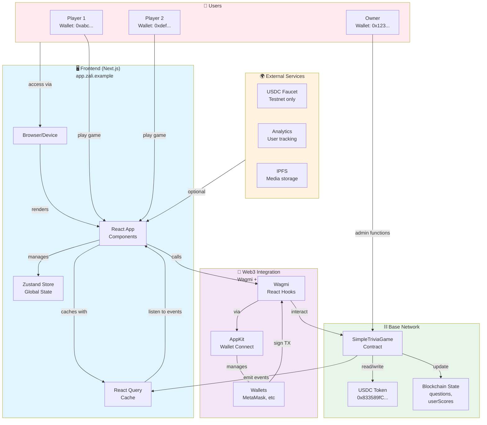

# System Overview & Architecture Summary

High-level visual summary of the Zali system architecture and how all components work together.

---

## 📋 Executive Summary

**Zali** is a Web3 trivia game on Base Network where:
- Users connect wallets and play trivia questions
- Earn USDC rewards for correct answers
- View rankings on leaderboard
- Smart contracts manage questions and rewards

**Tech Stack:**
- Frontend: Next.js + React + TypeScript
- State: Zustand + React Query
- Blockchain: Solidity + Base Network
- Web3: Wagmi + Viem

---

## 🌐 Complete System Overview



---

## 🎮 The Game Flow (Step by Step)

### Step 1: User Connection
```
User connects wallet
  ↓
AppKit shows wallet options
  ↓
User selects MetaMask (or other)
  ↓
MetaMask opens
  ↓
User approves connection
  ↓
App verifies network (Base)
  ↓
✅ User logged in
```

### Step 2: View Game
```
User navigates to /play
  ↓
Frontend loads QuestionCard component
  ↓
Component calls useQuestion() hook
  ↓
Hook checks React Query cache
  ↓
Cache miss → Call contract getQuestion()
  ↓
Contract returns question data
  ↓
React Query caches result
  ↓
✅ Question displayed
```

### Step 3: Submit Answer
```
User selects answer option
  ↓
Component calls useContractWrite()
  ↓
Wagmi validates input
  ↓
Wagmi estimates gas
  ↓
Wagmi requests wallet signature
  ↓
User approves in MetaMask
  ↓
Transaction sent to Base Network
  ↓
Blockchain executes submitAnswer()
  ↓
Contract checks if answer correct
  ↓
If correct: Transfer USDC reward
  ↓
Contract emits AnswerSubmitted event
  ↓
✅ Transaction confirmed
```

### Step 4: Update UI
```
Event listener catches AnswerSubmitted
  ↓
Frontend receives event data
  ↓
Zustand store updates with new score
  ↓
React components re-render
  ↓
✅ UI shows result and new score
```

---

## 📊 Data Architecture

### Where Data Lives

```
┌────────────────────────────────────────────────┐
│        Frontend (Browser Memory)               │
│  ┌──────────────────────────────────────────┐  │
│  │   React Component State                  │  │
│  │   - Loading states                       │  │
│  │   - UI toggles                           │  │
│  │   - Form inputs                          │  │
│  └──────────────────────────────────────────┘  │
│                     ↕                           │
│  ┌──────────────────────────────────────────┐  │
│  │   Zustand Global Store                   │  │
│  │   - User info                            │  │
│  │   - User score                           │  │
│  │   - Current question                     │  │
│  │   - Theme & UI settings                  │  │
│  └──────────────────────────────────────────┘  │
│                     ↕                           │
│  ┌──────────────────────────────────────────┐  │
│  │   React Query Cache                      │  │
│  │   - Questions                            │  │
│  │   - Leaderboard                          │  │
│  │   - User profiles                        │  │
│  │   - (5-minute TTL)                       │  │
│  └──────────────────────────────────────────┘  │
│                     ↕                           │
│  ┌──────────────────────────────────────────┐  │
│  │   LocalStorage (Persistent)              │  │
│  │   - User preferences                     │  │
│  │   - Cached auth                          │  │
│  │   - Saved settings                       │  │
│  └──────────────────────────────────────────┘  │
└────────────────────────────────────────────────┘
                     ↕ Wagmi
┌────────────────────────────────────────────────┐
│        Smart Contract (Blockchain)             │
│  ┌──────────────────────────────────────────┐  │
│  │   Questions Mapping                      │  │
│  │   questionId → Question struct           │  │
│  │   - text, options, reward                │  │
│  │   - category, difficulty                 │  │
│  └──────────────────────────────────────────┘  │
│                                                 │
│  ┌──────────────────────────────────────────┐  │
│  │   User Scores Mapping                    │  │
│  │   userAddress → score (uint256)          │  │
│  └──────────────────────────────────────────┘  │
└────────────────────────────────────────────────┘
```

---

## 🔄 Component Interaction Patterns

### Pattern 1: Read-Only Operation

```
Component
    ↓
Custom Hook (useQuestion)
    ↓
React Query Hook
    ├─ Cache hit? → Return data
    └─ Cache miss?
        ↓
    Wagmi Hook (useContractRead)
        ↓
    Smart Contract (getQuestion)
        ↓
    Blockchain reads mapping
        ↓
    Return to React Query
        ↓
    Cache result
        ↓
Return to component
    ↓
Component displays data
```

### Pattern 2: State-Modifying Operation

```
User clicks button
    ↓
Component event handler
    ↓
Validation & UI update
    ↓
Custom Hook (useSubmitAnswer)
    ↓
Wagmi Hook (useContractWrite)
    ↓
Validate transaction
    ↓
Request wallet signature
    ↓
User approves in wallet
    ↓
Send to blockchain
    ↓
Contract executes
    ↓
Emit event
    ↓
Event listener catches event
    ↓
Update Zustand store
    ↓
Trigger component re-render
    ↓
Display new state to user
```

---

## 🛡️ Error Handling Coverage

```
┌─────────────────────────────────┐
│  Root Error Boundary            │ Catches: Network crash, memory error
├─────────────────────────────────┤
│    ↓                            │
│  Wallet Error Boundary          │ Catches: Wallet rejected, not connected
├─────────────────────────────────┤
│    ↓                            │
│  Query Error Boundary           │ Catches: RPC call failed
├─────────────────────────────────┤
│    ↓                            │
│  Contract Error Boundary        │ Catches: Contract reverted
├─────────────────────────────────┤
│    ↓                            │
│  ┌──────────────────────────┐   │
│  │ Transaction Error        │   │ Catches: TX failed, gas exceeded
│  │ Boundary                 │   │
│  └──────────────────────────┘   │
│  ┌──────────────────────────┐   │
│  │ Form Error Boundary      │   │ Catches: Validation failed
│  └──────────────────────────┘   │
│  ┌──────────────────────────┐   │
│  │ Route Error Boundary     │   │ Catches: Component crash
│  └──────────────────────────┘   │
└─────────────────────────────────┘
```

---

## 📱 Component Relationship Map

```
App Layout (root)
├── Providers
│   ├── Wagmi Provider
│   ├── Query Client Provider
│   └── AppKit Provider
│
├── Navigation
│   └── Navbar
│
└── Routes
    ├── / (Home)
    ├── /play
    │   ├── QuestionCard
    │   ├── OptionButtons
    │   ├── Timer
    │   ├── ScoreDisplay
    │   └── RewardCard
    ├── /leaderboard
    │   ├── Filters
    │   ├── DataTable
    │   │   └── Row × N
    │   └── Pagination
    ├── /profile
    │   ├── UserHeader
    │   ├── Tabs
    │   ├── Stats
    │   └── History
    ├── /admin
    │   ├── QuestionManager
    │   ├── UserManager
    │   └── Analytics
    └── /faucet
        └── FaucetForm
```

---

## 🔐 Authentication & Authorization

```
NO LOGIN → Public Pages
├─ /
├─ /about
└─ /faucet

LOGGED IN → Protected Pages
├─ /play
├─ /leaderboard
├─ /profile/[address]
└─ /results

OWNER ONLY → Admin Pages
├─ /admin
├─ /admin/questions
└─ /admin/users
```

---

## 💰 Reward Flow

```
User plays question
    ↓
Selects answer
    ↓
Submits to contract
    ↓
Contract checks if correct
    ↓
IF CORRECT:
├─ Increment user score in mapping
├─ Get reward amount from question
├─ Transfer USDC to user address
└─ Emit AnswerSubmitted(user, questionId, true, reward)

IF INCORRECT:
├─ Increment user score in mapping
└─ Emit AnswerSubmitted(user, questionId, false, 0)

Event listener:
├─ Receives event
├─ Updates Zustand store
└─ Triggers UI update
```

---

## 🚀 Deployment Topology

```
┌─────────────────────────────┐
│  Users' Devices             │
│  (Browsers)                 │
└────────────┬────────────────┘
             │ HTTPS
             ↓
┌─────────────────────────────┐
│  CDN (Cloudflare)           │
│  (Static Frontend)          │
└────────────┬────────────────┘
             │ DNS
             ↓
┌─────────────────────────────┐
│  app.zali.example           │
│  (Domain & Certificate)     │
└────────────┬────────────────┘
             │ JSON-RPC
             ↓
┌─────────────────────────────┐
│  Base Network RPC           │
│  (Alchemy or Public RPC)    │
└────────────┬────────────────┘
             │ EVM Calls
             ↓
┌─────────────────────────────┐
│  SimpleTriviaGame Contract  │
│  (0x7409Cbcb6577164E96A9b...) │
└────────────┬────────────────┘
             │ Transfers
             ↓
┌─────────────────────────────┐
│  USDC Token Contract        │
│  (0x833589fCD6eDb6E08f4c7...) │
└─────────────────────────────┘
```

---

## 📈 Scaling Consideration

```
Current Implementation (SimpleTriviaGame v1.0)
├─ Single contract on Base
├─ All data on-chain
├─ Direct TX per answer
└─ ~120k gas per question

Future (TriviaGameV2 v2.0 - Q2 2026)
├─ VRF randomness
├─ Game sessions (10 questions)
├─ Leaderboard system
├─ Usernames
├─ Speed bonuses
└─ Optimized for scale
```

---

## 🔗 Key Connections

**Frontend ↔ Blockchain:**
- Wagmi provides React hooks
- AppKit handles wallet connections
- Automatically reconnects on page load

**State ↔ UI:**
- Zustand holds global state
- Components subscribe to store
- Auto-rerender on state change

**Events ↔ State:**
- Contract emits events
- Frontend listens for events
- Updates state when event fires

**Cache ↔ Fresh Data:**
- React Query caches for 5 minutes
- Can invalidate manually
- Automatic refetch on focus

---

## ⚙️ Configuration

### Environment Variables (Frontend)
```
NEXT_PUBLIC_CONTRACT_ADDRESS=0x7409Cbcb...
NEXT_PUBLIC_USDC_ADDRESS=0x833589fC...
NEXT_PUBLIC_CHAIN_ID=8453
NEXT_PUBLIC_RPC_URL=https://base.llamarpc.com
```

### Environment Variables (Contract)
```
BASE_RPC_URL=https://base.llamarpc.com
PRIVATE_KEY=0x...
ETHERSCAN_API_KEY=...
```

---

## ✨ Performance Optimizations Applied

1. **Caching**
   - React Query caches API responses
   - Zustand persists to localStorage
   - Browser caches static assets

2. **Code Splitting**
   - Next.js route-based splitting
   - Dynamic component imports
   - Lazy load heavy components

3. **Gas Optimization**
   - Batch contract reads
   - Efficient struct packing
   - Minimal state writes

4. **Network Optimization**
   - Event-driven updates vs polling
   - Batch transactions
   - CDN for static assets

---

## 🎓 Key Concepts Explained

**Zustand:** Lightweight state management - like Redux but simpler
**Wagmi:** React library for Web3 - makes contract calls easy
**React Query:** Manages cached server state - prevents unnecessary calls
**AppKit:** Wallet connection UI - handles MetaMask, WalletConnect, etc
**Error Boundaries:** React component that catches JS errors

---

## 📞 How to Find Things

| What | Where |
|------|-------|
| Pages/routes | `frontend/src/app/` |
| Components | `frontend/src/components/` |
| Global state | `frontend/src/store/` |
| API calls | `frontend/src/services/` |
| Contracts | `contracts/src/` |
| Types | `frontend/src/types/` |
| Utilities | `frontend/src/utils/` |

---

## 🎯 Next Steps for Developers

1. **New to project?** Read ARCHITECTURE_INDEX.md
2. **Want to contribute?** Check issue labels on GitHub
3. **Found a bug?** Create detailed issue with steps to reproduce
4. **Have an idea?** Start a discussion
5. **Ready to code?** Follow CONTRIBUTING.md guidelines

---

**System Overview Version:** 1.0  
**Last Updated:** January 26, 2026  
**Status:** Complete

For detailed diagrams, see [ARCHITECTURE_DIAGRAMS.md](ARCHITECTURE_DIAGRAMS.md)
